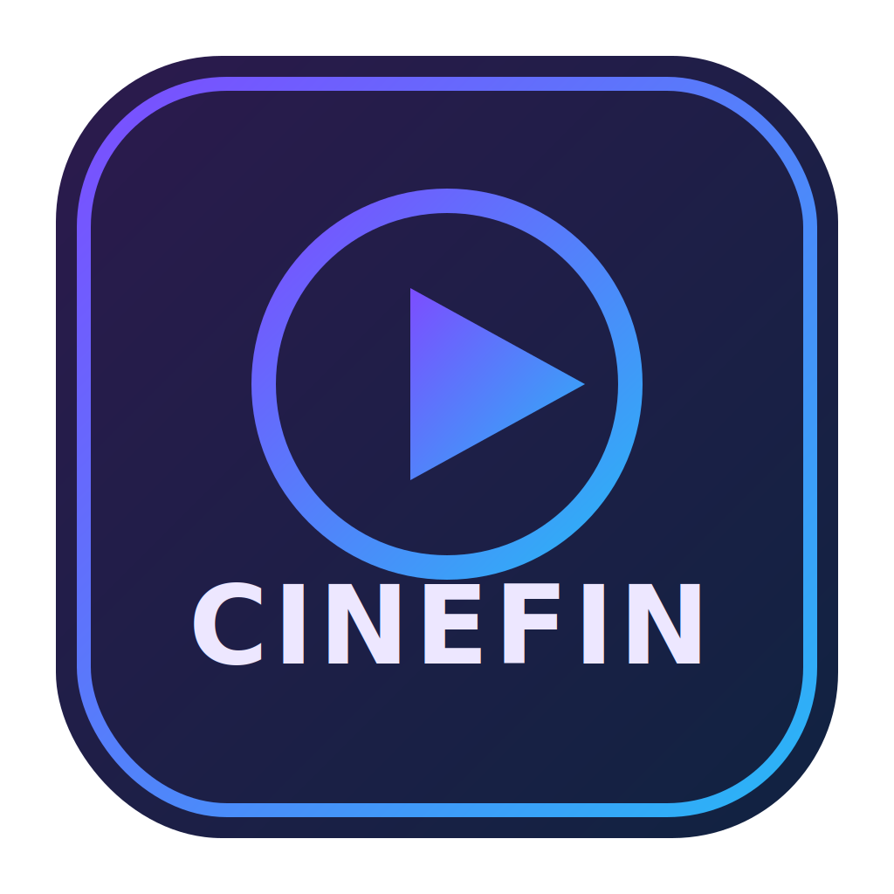

# Cinefin Android

> A refreshed Android Jellyfin client experience (formerly **Jellyfin Android Client**).

<p align="center">
  
</p>

[](https://github.com/rpeters1430/JellyfinAndroid/actions/workflows/android-ci.yml)
[](https://github.com/rpeters1430/JellyfinAndroid/actions/workflows/dependency-check.yml)
[](https://android-arsenal.com/api?level=26)

A modern, beautiful Android client for Jellyfin media servers built with Material 3 design principles and the latest Android development technologies.

## ✨ Features

### 🎨 **Modern Material 3 Design**
- **Expressive theming** with dynamic colors and Jellyfin brand colors
- **Adaptive navigation** that responds to different screen sizes
- **Beautiful carousel** showcasing recently added content
- **Dark/Light theme** support with system integration

### 🎬 **Rich Media Experience**
- **Browse media libraries** with stunning visual cards
- **Recently added carousel** with cinematic 16:9 aspect ratio cards
- **High-quality poster/backdrop** images with smart loading
- **Metadata display** including ratings, years, and descriptions
- **ExoPlayer video playback** with Direct Play detection and subtitles
- **Auto-play next episode** with countdown UI

### 🔐 **Secure Authentication**
- **Server connection testing** before authentication
- **Token-based authentication** with automatic session management
- **Multi-server support** (connect to different Jellyfin instances)
- **Quick Connect** support

### 📺 **Casting & Multitasking**
- **Chromecast** with seek/volume control and position tracking
- **Picture-in-Picture** with playback controls

### 📱 **Modern Android Architecture**
- **Jetpack Compose** for declarative UI
- **MVVM pattern** with ViewModels and StateFlow
- **Hilt dependency injection** for clean architecture
- **Kotlin Coroutines** for asynchronous operations

## 🛠️ Technical Stack

### **Core Technologies**
- **Language:** Kotlin 2.3.0
- **UI Framework:** Jetpack Compose (2026.01.01 BOM)
- **Architecture:** MVVM + Repository Pattern
- **Dependency Injection:** Hilt 2.59
- **Async Programming:** Kotlin Coroutines 1.10.2

### **Networking & API**
- **Jellyfin SDK:** 1.8.6 (Official Jellyfin Kotlin SDK)
- **HTTP Client:** Retrofit 3.0.0 + OkHttp 5.3.2 (official Kotlinx Serialization converter)
- **Serialization:** Kotlinx Serialization 1.10.0
- **Image Loading:** Coil 3.3.0 with Compose integration

### **Media & UI**
- **Media Playback:** ExoPlayer (Media3 1.9.1) with Jellyfin FFmpeg decoder
- **Material Design:** Material 3 Expressive (alpha)
- **Navigation:** Navigation Compose 2.9.7
- **Data Storage:** DataStore Preferences 1.3.0-alpha05

## 📱 Requirements

- **Android 8.0** (API level 26) or higher
- **Active Jellyfin server** (version 10.8.0 or later recommended)
- **Internet connection** for streaming
- **Java 21** with core library desugaring enabled

## 🚀 Getting Started

### Prerequisites
- Android Studio Iguana or later
- JDK 21
- **Compile SDK:** 36
- **Target SDK:** 35

### Building the Project

1. **Clone the repository:**
   ```bash
   git clone https://github.com/rpeters1430/JellyfinAndroid.git
   cd JellyfinAndroid
   ```

2. **Open in Android Studio:**
   - Import the project
   - Sync Gradle files
   - Wait for indexing to complete

3. **Build and run:**
   ```bash
   ./gradlew assembleDebug
   # Or use Android Studio's Run button
   ```
   
   Optional:
   ```bash
   ./gradlew installDebug    # Install on a connected device/emulator
   ```

### First Launch Setup

1. **Launch the app** on your device/emulator
2. **Enter your Jellyfin server URL** (e.g., `https://jellyfin.example.com`)
3. **Provide your credentials** (username and password)
4. **Start browsing** your media collection!

## 🏗️ Project Structure

```
app/src/main/java/com/rpeters/jellyfin/
├── JellyfinApplication.kt       # Application class with Hilt
├── MainActivity.kt              # Main activity with navigation
├── core/                        # Core constants and helpers
├── data/                        # Models, paging, and repositories
├── di/                          # Hilt modules
├── ui/                          # Compose screens, navigation, and viewmodels
└── utils/                       # Utility classes
```

Additional paths:
- Module: `:app`
- Resources: `app/src/main/res`
- Manifest: `app/src/main/AndroidManifest.xml`
- Unit tests: `app/src/test/java`
- Instrumentation tests: `app/src/androidTest/java`

## 🎯 Key Components

### **🎠 Material 3 Carousel**
Beautiful horizontal carousel showcasing recently added content:
- **Scaled animations** (active items at 100%, others at 85%)
- **Gradient overlays** for text readability
- **Rich metadata** display with ratings and descriptions
- **Smooth scrolling** with page indicators

### **🏠 Home Screen**
Personalized dashboard featuring:
- **Welcome header** with server information
- **Recently added carousel** highlighting new content
- **Library grid** for quick access to collections
- **Pull-to-refresh** functionality

### **📚 Library Browser**
Browse your media collections with:
- **Visual library cards** with cover art
- **Collection type badges** (Movies, TV Shows, Music, etc.)
- **Item counts** and metadata
- **Loading states** with skeleton screens

### **⭐ Favorites**
Quick access to your favorite content:
- **Favorite indicators** on media cards
- **Dedicated favorites screen**
- **Star ratings** display
- **Fast browsing** experience

## 🔧 Development

### **Build, Test, Lint, Coverage**
- **Build debug APK:** `./gradlew assembleDebug`
- **Install debug APK:** `./gradlew installDebug`
- **Unit tests (JVM):** `./gradlew testDebugUnitTest`
- **Instrumentation tests:** `./gradlew connectedAndroidTest` (device/emulator required; uses `HiltTestRunner`)
- **Android Lint:** `./gradlew lintDebug`
- **Coverage (JaCoCo):** `./gradlew jacocoTestReport` (HTML/XML under `app/build/reports`)

### **Codex/Web/CI Environment Setup**
- Ensure an Android SDK is available and set `ANDROID_SDK_ROOT` (or `ANDROID_HOME`).
- If no SDK is installed, run `./setup.sh` to install cmdline-tools, accept licenses, and provision the SDK (Linux/macOS shells).
- Generate `local.properties` from your env: `scripts/gen-local-properties.sh` (bash) or `scripts/gen-local-properties.ps1` (PowerShell).
- Then build as usual: `./gradlew assembleDebug`.

### **Code Style & Naming**
- **Kotlin conventions**, 4-space indent, ~120 char lines
- **Material 3** UI, unidirectional data flow, **MVVM** with ViewModels
- **DI via Hilt**; repositories for data access
- Names: Classes `PascalCase`, functions/vars `camelCase`, constants `UPPER_SNAKE_CASE`

### **CI/CD**
Automated workflows for:
- ✅ **Build verification** on every push
- 🧪 **Unit testing** with detailed reports
- 🔍 **Code quality** checks (lint, security scans)
- 📦 **Dependency monitoring** (weekly updates)
- 🚀 **Automated releases** on git tags

## 🎨 Design System

### **Colors**
- **Primary:** Jellyfin Purple (#6200EE)
- **Secondary:** Jellyfin Blue (#2962FF)  
- **Tertiary:** Jellyfin Teal (#00695C)
- **Dynamic theming** support for Android 12+

### **Typography**
- **Material 3 type scale** implementation
- **Accessible contrast ratios**
- **Responsive text sizing**

### **Components**
- **Cards:** Elevated with rounded corners
- **Buttons:** Material 3 filled and outlined variants
- **Navigation:** Adaptive navigation suite
- **Loading:** Progress indicators and skeleton screens

## 📚 Documentation

For detailed information on features, development, and project planning, please visit our **[Central Documentation Index](docs/README.md)**.

**Quick Links**:
- **[Current Status](docs/plans/CURRENT_STATUS.md)** - Verified project status and features
- **[Roadmap](docs/plans/ROADMAP.md)** - Development roadmap and planned features
- **[Known Issues](docs/features/KNOWN_ISSUES.md)** - Active bugs and workarounds
- **[Upgrade Path](docs/plans/UPGRADE_PATH.md)** - Dependency upgrade strategy
- **[Immersive UI Progress](docs/features/IMMERSIVE_UI_PROGRESS.md)** - Detailed tracking of the Immersive UI overhaul
- **[AI Setup Guide](docs/development/AI_SETUP.md)** - Instructions for configuring AI features

### **Current Status (Q1 2026)** ✅
- [x] **Rebrand underway** in docs from *Jellyfin Android Client* to **Cinefin Android**
- [x] **Core client** is stable: auth, libraries, details, search, favorites, and playback
- [x] **Playback experience** supports Direct Play checks, subtitles, PiP, and next-episode autoplay
- [x] **Casting support** is available with transport controls and progress synchronization
- [x] **Android CI workflow** is active and badge-enabled in this README

### **Active Development: Core Experience Polish** 🔴 *HIGH PRIORITY*
- [ ] **Branding assets rollout**: replace launcher/marketing assets with Cinefin artwork across modules
- [ ] **Music playback**: background play + notification controls
- [ ] **Offline downloads**: queueing, storage management, offline playback
- [ ] **Android TV focus**: D-pad navigation, focus visuals, and TV polish
- [ ] **Code quality**: split large composables and reduce lint debt

### **Upcoming Priorities** 📋
- **Platform expansion**: deeper Android TV and tablet optimization
- **Advanced media**: music playback, offline downloads, live TV
- **Power-user features**: sync play, widgets, queue controls

**[📖 See detailed roadmap in docs/plans/ROADMAP.md](docs/plans/ROADMAP.md)**

## 🤝 Contributing

We welcome contributions! Please see our [Contributing Guidelines](docs/development/CONTRIBUTING.md) for details.

### **Development Setup**
1. Fork the repository
2. Create a feature branch
3. Make your changes
4. Add tests if applicable
5. Submit a pull request

### **Issue Reporting**
- Use the GitHub issue tracker
- Provide detailed reproduction steps
- Include device/OS information
- Attach logs when possible

### **Conventional Commits**
Follow Conventional Commits for all commit messages:
- `feat:` new feature
- `fix:` bug fix
- `docs:` documentation only changes
- `refactor:` code change that neither fixes a bug nor adds a feature
Examples: `feat: add movie detail screen`, `fix: prevent crash on empty library`.

### **Branching**
- `feature/...` for new features
- `bugfix/...` for bug fixes
- `hotfix/...` for urgent fixes
- `docs/...` for documentation updates

### **PR Checklist**
- Clear description and linked issue(s)
- Screenshots/GIFs for UI changes
- Tests added/updated where applicable
- `./gradlew testDebugUnitTest` passes
- `./gradlew lintDebug` passes
- Docs updated (README/CHANGELOG if needed)
- Note affected areas and test coverage in the PR body

## 🧪 Testing Guidelines
- Focus tests on ViewModel/Repository logic
- Use JUnit4, MockK, Turbine, AndroidX Test
- Mock network and I/O; avoid real server calls in unit tests
- Name tests descriptively (e.g., `loadMovieDetails_updates_state_on_success`)
- Coverage via `jacocoTestReport`; generated/DI classes are already filtered
 - Hilt testing is configured; use `HiltAndroidRule` and `HiltTestRunner` for instrumented tests

## 🔒 Security & Configuration
- Never commit secrets/keystores. Use Android Keystore/Encrypted storage.
- Network config at `app/src/main/res/xml/network_security_config.xml`.
- Min SDK 26, Target/Compile SDK 36.
- Keep dependency versions centralized in `gradle/libs.versions.toml`.

## 🔐 Privacy Policy

This app respects your privacy and data security:
- **No personal data collection** - We don't collect names, emails, or payment information
- **Local-only credentials** - Server URLs and authentication tokens are stored locally on your device only
- **Direct server connection** - All media streaming flows directly between your device and your Jellyfin server
- **Limited analytics** - Only crash reports and performance metrics (via Firebase) for app stability

For detailed information, see our [Privacy Policy](privacy-policy.md).

## 📄 License

This project is licensed under the MIT License - see the [LICENSE](LICENSE) file for details.

## 🙏 Acknowledgments

- **Jellyfin Team** for the amazing media server platform
- **Android Team** for Jetpack Compose and Material 3
- **Community** for feedback and contributions

## 📞 Support

- **GitHub Issues:** [Report bugs and request features](https://github.com/rpeters1430/JellyfinAndroid/issues)
- **Jellyfin Community:** [Official Jellyfin forums](https://forum.jellyfin.org/)
- **Documentation:** [Jellyfin API docs](https://api.jellyfin.org/)

---

**Made with ❤️ for the Jellyfin community**
